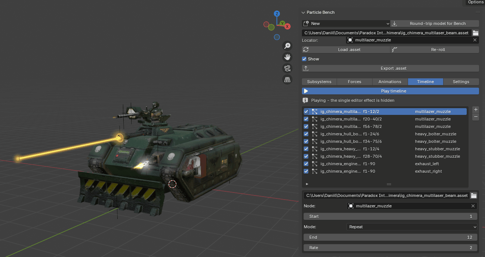

# pdx-blender-tools

Blender tooling for Paradox / Clausewitz asset work - currently Hearts of Iron IV.

Two independent add-ons, each in its own folder - install whichever you need:

| | |
|---|---|
| [`pdx_particle_bench/`](pdx_particle_bench/) | preview, edit and sequence particle `.asset` effects live on the real mesh, with the engine's measured simulation |
| [`io_pdx_mesh/`](io_pdx_mesh/) | a fork of ross-g's mesh/anim importer-exporter, fixed for Blender 4.x and extended with rigging helpers |

**Scope: Blender only, Hearts of Iron IV only.**

## PDX Particle Bench

Particle `.asset` files are normally authored blind - edit, launch the game, look, repeat. This
add-on parses the `.asset`, **simulates it, and draws it attached to a locator on the real mesh**,
so timing, size and direction can be judged without a launch. Its simulation constants and axis
conventions were **measured against the game**, not guessed, and it draws through Blender's `gpu`
module for true additive blending.

- **Edit** every part live - subsystems, forces and animation curves - starting from templates,
  and export back to a valid `.asset`.
- **Timeline** - fire many effects, each at its own node and frame (one-shot / continuous /
  repeat), and scrub a whole animation's effects playing in place.

Viewport-only (calibrated for the simulation, not the game's post-processed on-screen colour).
Version history and known limitations: [`pdx_particle_bench/CHANGELOG.md`](pdx_particle_bench/CHANGELOG.md).

## io_pdx_mesh fork

Upstream [io_pdx_mesh](https://github.com/ross-g/io_pdx_mesh) has had no release since
**2024-09-23 (v0.91)** and does not run correctly on Blender 4.x. This fork fixes the 4.x import
crash, flat shading and export-pivot bugs, resolves textures across the whole `models/` tree, and
adds four rigging operators (orient bone, flip bone, align weapon, extract to `.blend`). Full
list: [`io_pdx_mesh/CHANGES.md`](io_pdx_mesh/CHANGES.md).

## Install

Both are ordinary Blender add-ons (tested on **4.2**). Grab the zips from the
[latest release](https://github.com/Twitilit/pdx-blender-tools/releases/latest), or zip a folder
yourself, and install via `Edit > Preferences > Add-ons > Install...`. Both panels live in the 3D
view sidebar (<kbd>N</kbd>): the bench under **Particle Bench**, the mesh tools under **PDX
Blender Tools**.

For `pdx_particle_bench/`, set **Mod root** and **Vanilla root** in its preferences (texture paths
resolve mod-first then vanilla, as the game does), and set the view transform to **Standard**
(Blender 4.x defaults to AgX, which desaturates colour and misleads a comparison).

## License

**GPL-3.0-or-later.** `io_pdx_mesh/` is a modified copy of
[io_pdx_mesh](https://github.com/ross-g/io_pdx_mesh), copyright (C) ross-g, redistributed under
GPL-3.0-or-later; modifications are in [`io_pdx_mesh/CHANGES.md`](io_pdx_mesh/CHANGES.md), marked
inline with `# FORK:`, and the original license text is at `io_pdx_mesh/license.txt`. Everything
else is GPL-3.0-or-later too - Blender add-ons using `bpy` have to be.
